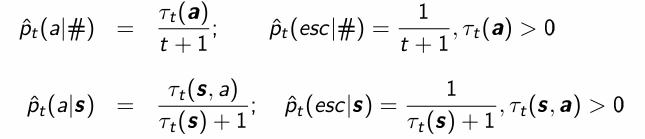
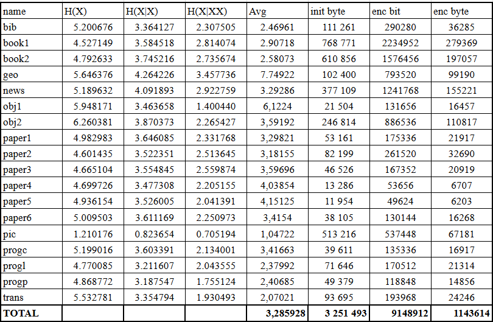

# Отчет По Лабораторной работе 1
### Капанин Дмитрий
## PPMA
Алгоритм PPMA строится на арифметическом кодере и декодере.  
Для кодирования нового символа нужно.
1) Найти для него максимальный контекст.
2) Уменьшать контекст, пока символ не встречался ранее с этим контекстом и кодировать esc для контекста (contexts[ctxHash], ALPHABET_SIZE)
3) Если контекст после уменьшения не пустой, то кодировать его в соответствии с вероятностью в этом контексте (contexts[ctxHash], in[i])
4) Если контекст пустой, то проверить встречался ли ранее символ
5) Если встречался закодировать в соответствии с вероятностью появления в последовательности (context[DEFAULT_CONTEXT_HASH], in[i])
6) Иначе передать esc и закодировать в соответствии с равномерным распределением неиспользованных символов в последовательности (context[DEFAULT_CONTEXT_HASH], ALPHABET_SIZE и context[UNIQUE_CONTEXT_HASH], in[i]) 
7) *Нужно исключать символы используемые в контекстах больше чем выбранный

Для декодирования нужно
1) Поддерживать контексты в идентичном состоянии
2) Совершать операции в том же порядке

Формулы  
  

Результаты  
  